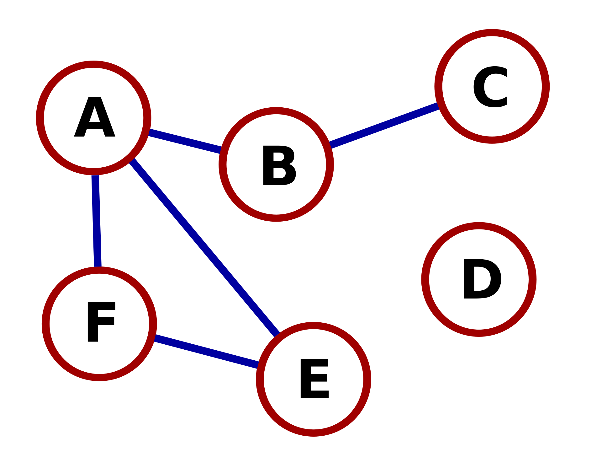

# Graph-Neural-Network
In this repository we present an implementation of Graph Neural Networks - GNNs for astroparticle application. In particular we will show how is possible using this new paradigm of Neural Networks to process informations which don't present an euclidean structure, so for that data in which convolution or other conventional techniques are not suitable. 
To implent GNN we use [Spektral](https://github.com/danielegrattarola/spektral#readme) which is a Python library for graph deep learning, based on the Keras API and TensorFlow 2. 

## What is a graph?

A graph is defined as G = (V,E,A) where V is a set of nodes (or vertex), E is a set of edges (or links) and A is the adjacency matrix. An example of graph is shown in the figure below

## Installation 

To run code it's essential that you've already installed [Keras](https://github.com/keras-team/keras) and [TensorFlow](https://github.com/tensorflow/tensorflow). To install Spektral the best way is from PyPi
